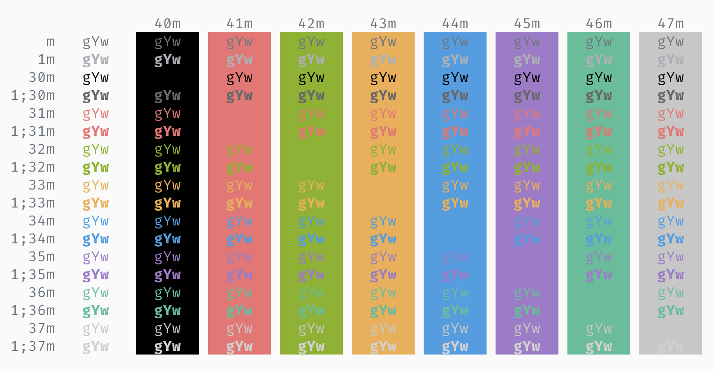
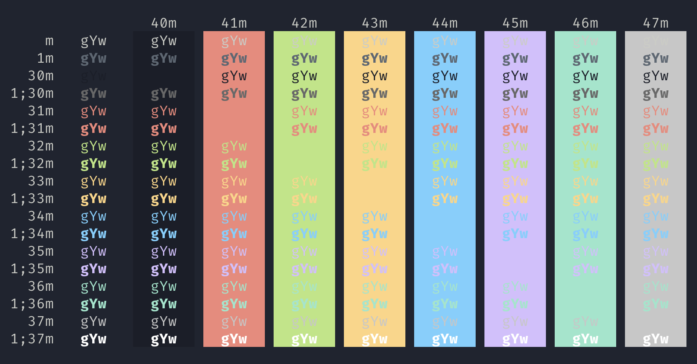
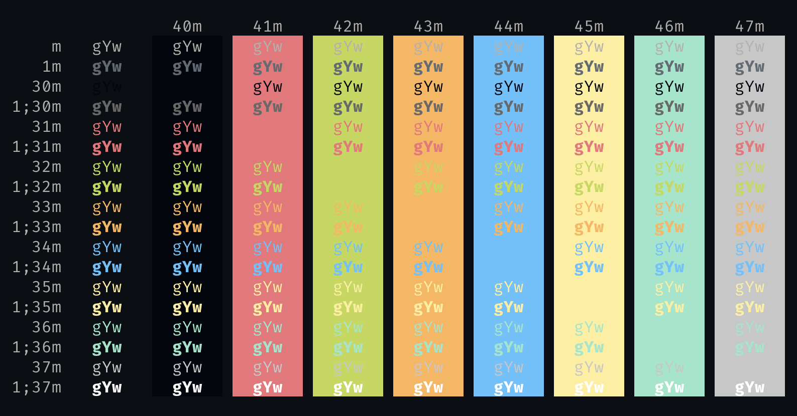

# ayu-Blink

> [ayu color theme](https://github.com/ayu-theme) for [Blink Shell](http://www.blink.sh)

## Screenshots

- ayu Light
  

- ayu Mirage
  

- ayu Dark
  

## How to install

- Install [Blink Shell](https://apps.apple.com/app/id1156707581) on your iOS Device.
- Enter `config` to turn on the configuration window.
- Just paste the URL of the JS theme under `Appearance` > `Themes` > `New Theme`.
  - ayu Dark: [https://raw.githubusercontent.com/hwyncho/ayu-Blink/master/ayu-Dark.js](https://raw.githubusercontent.com/hwyncho/ayu-Blink/master/ayu-Dark.js)
  - ayu Light: [https://raw.githubusercontent.com/hwyncho/ayu-Blink/master/ayu-Light.js](https://raw.githubusercontent.com/hwyncho/ayu-Blink/master/ayu-Light.js)
  - ayu Mirage: [https://raw.githubusercontent.com/hwyncho/ayu-Blink/master/ayu-Mirage.js](https://raw.githubusercontent.com/hwyncho/ayu-Blink/master/ayu-Mirage.js)
